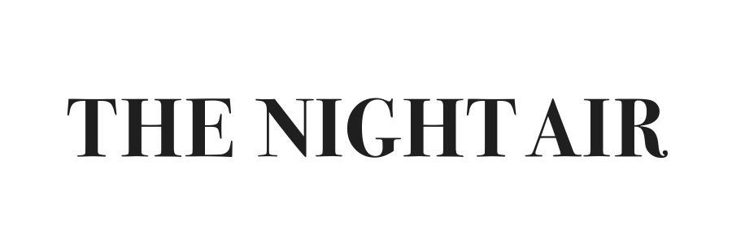

# The Night Air - Collaborative Poetry Website

## Introduction

Welcome to **The Night Air**, a unique website that invites visitors to embark on a collaborative poetic journey. In the spirit of creativity and connection, this platform allows users to co-create poetry with others, aided by a generative algorithm. 

**The Night Air** was born during the challenging days of the COVID-19 lockdown, with the goal of fostering a sense of togetherness and artistic expression during a time of isolation. The project received invaluable support from generous grants provided by the **Houston Arts Alliance**, **Art League Texas**, and the **Texas Council for the Arts**.

### Authorship

Website created by Josh Urban Davis
Project designed and developed in colaboration with Sarah Sudhoff and Josh Urban Davis
Graphic design by Stacy Mullens Studio

## Key Features

- **Collaborative Poetry:** Engage in poetic collaborations with users from around the world.
- **Generative Algorithm:** Leverage a generative algorithm to inspire and assist in your creative process.
- **Support from Arts Organizations:** Proudly supported by grants from the Houston Arts Alliance, Art League Texas, and the Texas Council for the Arts.
- **Full Creative Freedom:** Express yourself freely and find inspiration in shared words.

## Getting Started

1. Visit [The Night Air Website](https://www.thenightairpoetry.com/) to begin your creative journey.
2. Explore ongoing collaborative poems or start a new one.
3. Contribute your lines and watch as the poem evolves with each participant.
4. Feel the connection and creativity that inspired this project during challenging times.

## Support and Contact

For any inquiries or to learn more about **The Night Air**, please reach out to us at [your contact email address].

## Acknowledgments

- **Houston Arts Alliance**
- **Art League Texas**
- **Texas Council for the Arts**

---

**The Night Air** - Where isolation transforms into inspiration, and words unite to paint the canvas of collaboration.
